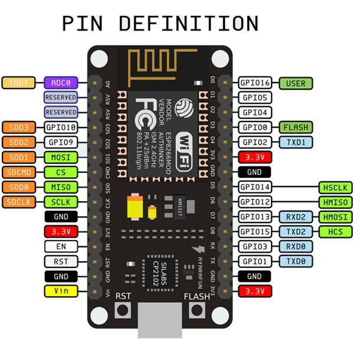

# IOT-Regador

Regador de plantas

## Pre-requisitos

### Instalar placas que serão usadas

Adicionar no campo `URLs Adicionais para Gerenciadores de Placas` as linhas abaixo, **separadas por vírgulas**:

* http://arduino.esp8266.com/stable/package_esp8266com_index.json


#### Instalar as placas


#### Referências
- [Preparando o ambiente com arduino IDE para ESP8266](https://blog.smartkits.com.br/esp8266-como-programar-o-nodemcu-atraves-da-arduino-ide/)

#### Instalar as bibliotecas

* ArduinoWebsockets
* Adafruit FONA Library
* Adafruit MQTT Library
* Adafruit SleepyDog Library
* Adafruit Unified Sensor
* ArduinoJson
* AsyncElegantOTA
* NTPClient
* PubSubClient
* WiFi101
* LittleFS_esp32
* Preferences

#### Instalar as bibliotecas .zip (fazer download do código e importar no arduino IDE)

* https://github.com/me-no-dev/ESPAsyncWebServer.git
* https://github.com/me-no-dev/ESPAsyncTCP.git

### Plugins

* Pre-requisito do arduino IDE: 

```
sudo apt install python3-serial -y
```

* Pre-requisito do ESP8266/ESP32 Exception Stack Trace Decoder:

#### Referência

1. [Arduino ESP8266/ESP32 Exception Stack Trace Decoder](https://github.com/me-no-dev/EspExceptionDecoder)

* Criar diretório se não existir

```
mkdir -p ~/Arduino/tools/
```

*  Mover o arquivo jar para dentro da pasta

```
mv ~/Downloads/EspExceptionDecoder-2.0.2.zip ~/Arduino/tools
```

* Descompactar

```
unzip EspExceptionDecoder-2.0.2.zip
```

* Remover arquivo

```
rm -rf EspExceptionDecoder-2.0.2.zip
```

* Instalar dependências

```
sudo apt install libncurses5 libpython2.7 -y
```

* Pre-requisito do ESP32 LittleFS filesystem uploader:

#### Referência

1. [Install ESP8266 NodeMCU LittleFS Filesystem Uploader in Arduino IDE](https://randomnerdtutorials.com/install-esp8266-nodemcu-littlefs-arduino/)


*  Mover o arquivo zip para dentro da pasta: `~/Arduino/tools/`

```
mv ~/Downloads/ESP8266LittleFS-2.6.0.zip ~/Arduino/tools/
```

* Descompactar

```
unzip ESP8266LittleFS-2.6.0.zip
```

* Remover arquivo

```
rm -rf ESP8266LittleFS-2.6.0.zip
```

### Compilação

1. No menu `Ferramentas`, escolha a opção `Upload Speed: "115200"`

2. No menu `Ferramentas`, escolha a opção `Flash Size: "4MB (FS:2MB OTA:~1019KB)"` (**o código supera o tamanho padrão de 1MB (FS:64KB OTA:~470KB)**)

- **Não se esqueça de alterar as variáveis abaixo, que aparecem nos códigos do arduino e dialogflow, para as suas chaves**

| Variáveis             | Serviço               |
|-----------------------|-----------------------|
| <AIO_USERNAME>        | Adafruit              |
| <AIO_KEY>             | Adafruit              |
| <API_WATER_TOKEN>     | Base64 Basic Auth     |
| <USER_FIRMWARE>       | Upload Firmware User  |
| <PASS_FIRMWARE>       | Upload Firmware Senha |
| <API_VERSION>         | Versão da API         |


3. Clique no botão de compilação 

> Se por acaso a compilação do arduino aparecer a mensagem: `"exec: "python": executable file not found in $PATH`, faça essa instalação abaixo:

```
sudo apt install python-is-python3
```

## Extras

- `sonar-project.properties` para configurar o projeto a ser analisado pelo sonar.

## Minimizando o Html e o Json para o Swagger

[Minifier](https://www.willpeavy.com/tools/minifier/)

### Adafruit☁️


## Referencias da placa ESP8266



 📣 No código arduino foram utilizadas as seguintes portas

| Porta       | Sensor       |
|-------------|--------------|
| D5          | Rele 1       |
| D6          | Rele 2       |
| D7          | Sensor nível |

## Tecnologias 💡

- [x] [Git](https://pt.wikipedia.org/wiki/Git)
- [x] [REST](https://pt.wikipedia.org/wiki/REST)
- [x] [MQTT-Adafruit](https://io.adafruit.com/api/docs/#adafruit-io-http-api)
- [x] [IOT-Arduino ESP8266](https://pt.wikipedia.org/wiki/ESP8266)
- [x] [Swagger](https://swagger.io/)
- [x] [Jenkins](https://www.jenkins.io/)
- [x] [Postman](https://www.postman.com/)
- [x] [QR code](https://www.qrcode-monkey.com/)
- [x] [SonarQube](https://docs.sonarqube.org/latest/setup/get-started-2-minutes/)

## Links utilizados no projeto 🔗

- [Switch Button](https://fribly.com/2015/11/28/css-minion-switch-button/)
- [React Charts](https://reactjsexample.com/a-react-environment-charts/)
- [Github Emoticons](https://gist.github.com/rxaviers/7360908)
- [API Rest - Antonio Mancuso](https://mancusoa74.blogspot.com/2018/02/simple-http-rest-server-on-esp8266.html)
- [NTP Client](https://randomnerdtutorials.com/esp8266-nodemcu-date-time-ntp-client-server-arduino/)
- [NTP Client](https://www.fernandok.com/2018/12/nao-perca-tempo-use-ntp.html)

## Bugs 🐛

- Em caso de encontrar algum bug, abra um pull request
